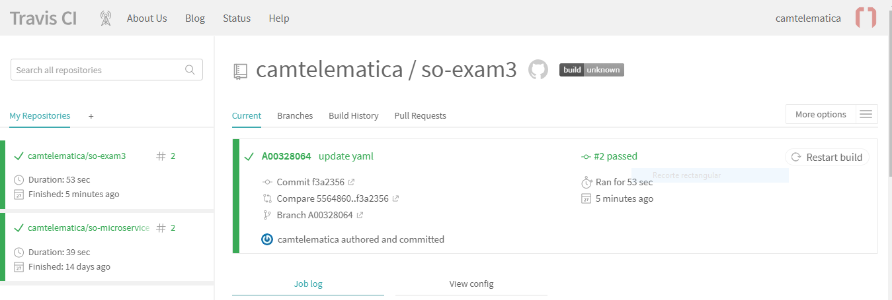

# so-exam3
**Nombre** Cristian Alejandro Morales Lopez

**Codigo** A00328064

**Materia** Sistemas Operacionales

**Correo personal** cristianalejandromoraleslopez@gmail.com

**URL Repositorio** https://github.com/camtelematica/so-exam3.git

### 3 Implementar un servicio web en Flask siguiendo la estructura definida en clase.
-primero, se clona el repositorio, desde icesi-training se crean dos archivos con las dependencias que se requieren, para el despliegue del servicio, los cuales llevan por nombre requirements_dev.txt y requirements.txt con el objetivo de desplegar el servicio web sobre el framework flask.
-A continuacion se crea un folder llamado op_stats donde se crea un file de tipo .py el cual lleva por nombre stats.py el cual contiene una clase llamada stats esta clase posee los metodos que dan informacion de datos del sistema operativo tales como: porcentaje de la cpu, memoria disponible y espacio libre en el disco:

```
import psutil

class Stats():

  @classmethod
  def obtener_disponible_cpu(cls):
    porcentaje = psutil.cpu_percent()
    return porcentaje

  @classmethod
  def obtener_disponible_memoria(cls):
    ram_disponible = psutil.virtual_memory().available
    return ram_disponible

  @classmethod
  def obtener_disponible_disco(cls):
    espacio_disponible = psutil.disk_usage('/').free
    return espacio_disponible
 ```
una vez creado este archivo proseguimos con la creacion de otro archivo .py el cual llevare por nombre app.py con los metodos necesarios para implementar el servicio sobre el framework flask.

```
from flask import Flask
import json
import sys
sys.path.append('/home/rootCam/so-exam3')
from op_stats.stats import Stats

app = Flask(__name__)

@app.route('/v1/cpu')
def obtener_info_cpu():
    disponible_cpu = Stats.obtener_disponible_cpu()
    return json.dumps({'Porcentaje CPU': disponible_cpu })

@app.route('/v1/memoria')
def obtener_info__memoria():
    disponible_memoria = Stats.obtener_disponible_memoria()
    return json.dumps({'Memoria Disponible': disponible_memoria})

@app.route('/v1/disco')
def obtener_info_disco():
    disponible_disco = Stats.obtener_disponible_disco()
    return json.dumps({'Espacio Libre Disco': disponible_disco})


if __name__ == '__main__':
    app.run(host='0.0.0.0',port=8080)

```
- el paso a seguir es ejecutar los scripts anteriormente creados con el comando "python app.py" para verificar la respuesta del servidor se utiliza la aplicacion Postman que contestara a las solicitudes HTTP que para esta ocasion sera el metodo get:

-peticion desde postman para pedir la informacion del porcentaje disponible de la CPU


-peticion desde postman para pedir la informacion de la memoria disponible del PC


-peticion desde postman para pedir la informacion del espacio del disco disponible


A continuacion se evidencia las solicitudes realizadas al servidor


### 4 Implemente las pruebas unitarias para los servicios empleando Fixtures y Mocks como se vio en clase. 
-como primer paso se crea un folder con el nombre de test donde se podran realizar las pruebas, dentro del folder se crea un archivo .py llamado test_stats-py para realizar las pruebas del servicio web.

```
import pytest
import sys
sys.path.append('/home/flaskdev/so-exam3')

from op_stats.app import app
from op_stats.stats import Stats

@pytest.fixture
def client():
  client = app.test_client()
  return client

def test_get_cpu_percent(mocker, client):
  mocker.patch.object(Stats, 'obtener_disponible_cpu', return_value=100)
  response = client.get('/v1/cpu')
  assert response.data.decode('utf-8') == '{"Porcentaje CPU": 100}'
  assert response.status_code == 200

def test_get_available_memory(mocker, client):
  mocker.patch.object(Stats, 'obtener_disponible_memoria', return_value=2000)
  response = client.get('/v1/memoria')
  assert response.data.decode('utf-8') == '{"Memoria Disponible": 2000}'
  assert response.status_code == 200


def test_get_disk_space(mocker, client):
  mocker.patch.object(Stats, 'obtener_disponible_disco', return_value=1000)
  response = client.get('/v1/disco')
  assert response.data.decode('utf-8') == '{"Espacio Libre Disco": 1000}'
  assert response.status_code == 200
```
para la comprobacion del funcionamiento le las pruebas se realiza con la ayuda de la libreria pytest con el comando ``pytest -v`` para correr las pruebas.


### 5 Emplee un servicio de integracíon continua que haga uso de las pruebas unitarias desarrolladas para validar sus commits.

para emplear el servicio de integracion continua se crea un archivo llamado tox.ini el cual posee informacion basica del proyecto y configurar como deseamos que se ejecute nuestro proyecto en este tambien se especifican las librerias, el lenguaje de programacion a utilizar, las dependencias y como ultima instancia los comando ejecutar para este caso es pytest.
```
[tox]
envlist = pytest

[testenv]
basepython = python

[testenv:pytest]
deps =
  -rrequirements_dev.txt
commands =
  pytest
  ```


-como paso final, se crea un archivo final con el nombre de .travis.yml que es un archivo de yexxto en formato YAML que se localiza en el directorio raiz de la estructura del proyecto. en este archivo se establecen caracteristicas como el lenguaje de programacion usado, el entorno de construccion y establecer las pruebas a realizar entre otros parametros. Una vez realizado este paso se ingresa a la pagina de travis-ci.org una vez sincronizado con la cuenta de github se activa la opcion para la pruebas y estas se ejecutaran cada vez que se realizen nuevos commits o pull request travis ejecutara los comandos especificados en .travis.yml 

```
sudo: false
language: python
notifications:
  email: false
python:
install: pip install tox-travis
script: tox -e pytest
``` 
a continuacion se aprecia la ejecucion de las pruebas desde www.travis-ci.org



